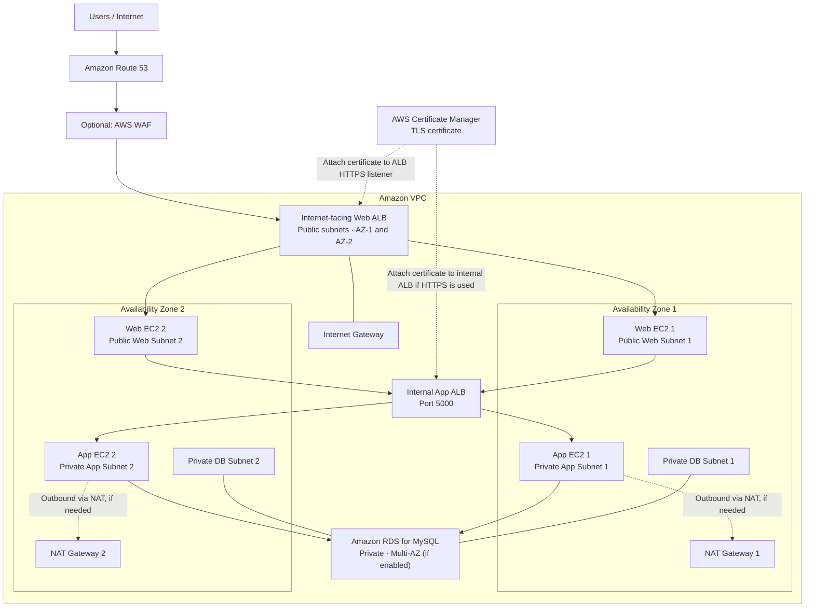

# AWS Three-Tier Web Application

A highly available, secure, and scalable three-tier web application deployed on AWS using a custom VPC, public and private subnets, Application Load Balancers, EC2, and Amazon RDS for MySQL.

> **Project note:** This README documents the architecture and setup. Replace example values such as domain names, database endpoints, IP addresses, and key-pair names with your own values. Never commit private keys, passwords, or other secrets to GitHub.

---

## Table of Contents

- [Project Overview](#project-overview)
- [Architecture](#architecture)
- [AWS Services Used](#aws-services-used)
- [Network Design](#network-design)
- [Security Groups](#security-groups)
- [Deployment Steps](#deployment-steps)
  - [1. Create the VPC](#1-create-the-vpc)
  - [2. Create the Six Subnets](#2-create-the-six-subnets)
  - [3. Create and Associate Route Tables](#3-create-and-associate-route-tables)
  - [4. Create Security Groups](#4-create-security-groups)
  - [5. Configure Route 53](#5-configure-route-53)
  - [6. Request and Validate an ACM Certificate](#6-request-and-validate-an-acm-certificate)
  - [7. Create the RDS MySQL Database](#7-create-the-rds-mysql-database)
  - [8. Launch the Web Server](#8-launch-the-web-server)
  - [9. Launch the App Server](#9-launch-the-app-server)
  - [10. Connect to the App Server](#10-connect-to-the-app-server)
  - [11. Set Up the Database](#11-set-up-the-database)
  - [12. Set Up the App Server](#12-set-up-the-app-server)
  - [13. Set Up the Web Server](#13-set-up-the-web-server)
- [Application Request Flow](#application-request-flow)
- [Validation and Testing](#validation-and-testing)
- [Security Recommendations](#security-recommendations)
- [Repository Structure](#repository-structure)
- [Cleanup](#cleanup)

---

## Project Overview

This project deploys a three-tier web application on AWS.

| Tier | Components | Responsibility |
|---|---|---|
| Web tier | Public subnets, web EC2 instances, internet-facing ALB | Receives user requests and serves the frontend |
| Application tier | Private subnets, app EC2 instances, internal ALB | Runs the Flask API and application logic |
| Database tier | Private DB subnets, Amazon RDS for MySQL | Stores application data |

The network is spread across two Availability Zones (AZs) to support availability. The database is private and accepts MySQL connections only from the application tier.

## Architecture



**Architecture notes**
- The internet-facing Web ALB is the public entry point. Users should access the application through its DNS name rather than directly through an EC2 public IP.
- The Web EC2 instances are in public subnets in this documented design. For stronger isolation, a common alternative is to place web instances in private subnets and expose only the ALB.
- The internal App ALB routes application requests to healthy Flask app instances.
- RDS is deployed in a DB subnet group spanning at least two AZs. Enable **Multi-AZ** if database failover is required; a subnet group alone does not enable Multi-AZ.
- NAT Gateways provide outbound access from private subnets. They do not allow unsolicited inbound internet connections.

## AWS Services Used

| AWS service | Purpose |
|---|---|
| Amazon VPC | Isolated network for the application |
| Subnets and route tables | Separate public, app, and database networks |
| Internet Gateway | Internet connectivity for public subnets |
| NAT Gateway | Outbound internet access for private instances |
| Security Groups | Instance- and load-balancer-level traffic control |
| Application Load Balancer | Distributes web and application traffic |
| Amazon EC2 | Hosts the web and Flask application servers |
| Amazon RDS for MySQL | Managed relational database |
| Amazon Route 53 | DNS hosting and domain routing |
| AWS Certificate Manager | TLS certificates for HTTPS |
| (Optional) EC2 Auto Scaling | Automatically maintains and adjusts EC2 capacity |
| (Optional) Amazon CloudWatch | Metrics, logs, and alarms |

---

## Network Design

### VPC

Create one VPC for the application.

| Setting | Example |
|---|---|
| Name | `three-tier-vpc` |
| IPv4 CIDR | `10.0.0.0/16` |
| Availability Zones | 2 |

Choose CIDR ranges that do not overlap with other networks connected to your VPC.

### Six subnets

Create six subnets across two Availability Zones.

| Availability Zone | Tier | Subnet name | Example CIDR | Type |
|---|---|---|---|---|
| AZ 1 | Web | `web-subnet-1` | `10.0.1.0/24` | Public |
| AZ 2 | Web | `web-subnet-2` | `10.0.2.0/24` | Public |
| AZ 1 | App | `app-subnet-1` | `10.0.3.0/24` | Private |
| AZ 2 | App | `app-subnet-2` | `10.0.4.0/24` | Private |
| AZ 1 | Database | `db-subnet-1` | `10.0.5.0/24` | Private |
| AZ 2 | Database | `db-subnet-2` | `10.0.6.0/24` | Private |

> The CIDR blocks are examples. Ensure that each subnet belongs to the intended AZ and does not overlap another subnet.

### Route tables

#### Public route table

Create `public-rt` and associate it with both web subnets.

| Destination | Target |
|---|---|
| VPC CIDR (`10.0.0.0/16`) | `local` (created automatically) |
| `0.0.0.0/0` | Internet Gateway |

#### Private application route tables

Use a separate route table for each app subnet. This design uses one NAT Gateway in each AZ.

| Route table | Subnet association | Destination | Target |
|---|---|---|---|
| `app-rt-1` | `app-subnet-1` | `0.0.0.0/0` | NAT Gateway 1 |
| `app-rt-2` | `app-subnet-2` | `0.0.0.0/0` | NAT Gateway 2 |

Each private route table also has the automatically created local VPC route.

#### Database route table

Create a database route table and associate it with both DB subnets.

| Destination | Target |
|---|---|
| VPC CIDR (`10.0.0.0/16`) | `local` |

RDS does not normally need a NAT Gateway for application database traffic. Add outbound routes only if a documented requirement calls for them; RDS maintenance is managed by the service.

### NAT Gateway placement

Create one NAT Gateway in each public AZ, each with an Elastic IP address. The app subnet in that AZ should route outbound internet traffic through its local NAT Gateway. NAT Gateways incur charges while provisioned, so remove them when the project is no longer in use.

---

## Security Groups

Create five security groups. Use security-group references as sources wherever possible instead of opening traffic to broad CIDR ranges.

> **Important:** The rules below describe the intended traffic path. For a production deployment, avoid public SSH access. Prefer AWS Systems Manager Session Manager or a tightly restricted administrative access path.

### 1. `WebServer-SG`

Attach to the web EC2 instances.

| Type | Protocol | Port | Source | Purpose |
|---|---|---:|---|---|
| SSH | TCP | 22 | Restricted administrator IP or management path | Administration, if needed |
| HTTP | TCP | 80 | `Web-ALB-SG` | Web traffic from the ALB |
| HTTPS | TCP | 443 | `Web-ALB-SG` | HTTPS traffic from the ALB, if used on instances |

If users connect through the Web ALB, do not open ports 80/443 on the web instances to the entire internet. If SSH is required, restrict it to a known administrator IP or use Session Manager.

### 2. `Web-ALB-SG`

Attach to the internet-facing Web ALB.

| Type | Protocol | Port | Source | Purpose |
|---|---|---:|---|---|
| HTTP | TCP | 80 | `0.0.0.0/0` | Public HTTP listener / redirect |
| HTTPS | TCP | 443 | `0.0.0.0/0` | Public HTTPS listener |

For IPv6-enabled public access, add the appropriate IPv6 source range as well. Configure the HTTPS listener with the ACM certificate.

### 3. `AppServer-SG`

Attach to the Flask application EC2 instances.

| Type | Protocol | Port | Source | Purpose |
|---|---|---:|---|---|
| Custom TCP | TCP | 5000 | `App-ALB-SG` | Flask API traffic from the internal ALB |
| SSH | TCP | 22 | Restricted management source | Administration, if required |

Do not open the Flask port to the internet. The app instances should receive application traffic only from the internal App ALB. If you administer the app instances through the web servers, use a carefully restricted management path; Session Manager is preferable.

### 4. `App-ALB-SG`

Attach to the internal App ALB.

| Type | Protocol | Port | Source | Purpose |
|---|---|---:|---|---|
| Custom TCP | TCP | 5000 | `WebServer-SG` | Requests from the web tier |
| HTTPS | TCP | 443 | `WebServer-SG` | Only if the internal ALB uses HTTPS |

An internal ALB should be configured as **internal**, not internet-facing. Allow only the traffic needed by the web tier.

### 5. `DB-SG`

Attach to the RDS database.

| Type | Protocol | Port | Source | Purpose |
|---|---|---:|---|---|
| MySQL/Aurora | TCP | 3306 | `AppServer-SG` | MySQL connections from app instances |

Set RDS **Public access** to **No**. Do not allow MySQL port 3306 from `0.0.0.0/0`.

### Security group traffic flow

```text
Internet
   |
   v
Web-ALB-SG (80/443)
   |
   v
WebServer-SG (web listener port)
   |
   v
App-ALB-SG (5000, or configured HTTPS)
   |
   v
AppServer-SG (5000)
   |
   v
DB-SG (3306)
   |
   v
RDS MySQL
```

Security groups are stateful. Ensure the inbound rules on each destination allow the required source and port. Also confirm that network ACLs and application listeners do not block the traffic.

---

## Deployment Steps

### 1. Create the VPC

1. Open the **Amazon VPC** console.
2. Choose **Your VPCs** → **Create VPC**.
3. Select **VPC only**.
4. Enter a name such as `three-tier-vpc`.
5. Set the IPv4 CIDR to `10.0.0.0/16` (or your chosen non-overlapping range).
6. Create the VPC.
7. Create or attach an Internet Gateway, then attach it to the VPC.

### 2. Create the Six Subnets

1. Open **Subnets** in the VPC console.
2. Create the two public web subnets, one in each AZ.
3. Create the two private app subnets, one in each AZ.
4. Create the two private database subnets, one in each AZ.
5. Use the CIDR plan in the [Network Design](#network-design) table, adjusting it if needed.
6. Enable auto-assign public IPv4 addresses only for the public subnets if your design requires it. Private app and DB subnets should not auto-assign public IPs.

### 3. Create and Associate Route Tables

1. Create `public-rt`, add the default route to the Internet Gateway, and associate both web subnets.
2. Create `app-rt-1` and `app-rt-2`.
3. Create one NAT Gateway in each public AZ and allocate an Elastic IP to each.
4. Add a default route in each app route table to the NAT Gateway in the same AZ.
5. Associate each app route table with its corresponding app subnet.
6. Create `db-rt` with only the local VPC route and associate both DB subnets.
7. Verify all subnet associations and routes.

### 4. Create Security Groups

1. Open **EC2** → **Security Groups**.
2. Create the five security groups listed in [Security Groups](#security-groups), selecting the project VPC.
3. Configure inbound rules using the tables above.
4. Attach each group to the correct load balancer, EC2 instance, or RDS database.
5. Verify the source security group references and listening ports before testing.

### 5. Configure Route 53

1. Open **Amazon Route 53**.
2. Create a **Public hosted zone** for a domain you own.
3. Copy the hosted zone's assigned name servers.
4. Open the domain registrar's DNS/name-server settings.
5. Replace the existing name servers with the Route 53 name servers.
6. Wait for the registrar changes and DNS delegation to propagate.
7. Later, create an alias record that points your application hostname to the Web ALB.

You must own or control the domain to update its name-server delegation.

### 6. Request and Validate an ACM Certificate

1. Open **AWS Certificate Manager (ACM)** in the same AWS Region as the ALB.
2. Choose **Request a certificate** → **Request a public certificate**.
3. Enter the domain name, for example `app.example.com`. Add any required subject alternative names.
4. Choose **DNS validation**.
5. Request the certificate.
6. Use the CNAME record ACM provides. If the hosted zone is in Route 53, create the suggested record there.
7. Wait until the certificate status is **Issued**.
8. Attach the certificate to the ALB HTTPS listener.

For an ALB, the ACM certificate must be in the same Region as the load balancer. If you also use HTTPS on an internal ALB, configure its listener and certificate separately as required.

### 7. Create the RDS MySQL Database

#### Create a DB subnet group

1. Open **Amazon RDS** → **Subnet groups**.
2. Create a DB subnet group and select the project VPC.
3. Add `db-subnet-1` and `db-subnet-2`, which must be in different AZs.
4. Save the subnet group.

#### Create the MySQL database

1. Open **Amazon RDS** → **Databases** → **Create database**.
2. Select **Standard create** and **MySQL**.
3. Choose a suitable DB instance class and storage size for the project.
4. Set the DB identifier and configure credentials securely.
5. Select the VPC and the DB subnet group created above.
6. Set **Public access** to **No**.
7. Attach `DB-SG`.
8. Enable Multi-AZ deployment if you need database standby/failover for this project.
9. Configure backups and maintenance settings.
10. Create the database and wait until it is available.
11. Copy the RDS endpoint for use by the application. Do not publish credentials.

### 8. Launch the Web Server

1. Open **Amazon EC2** → **Instances** → **Launch instances**.
2. Enter a name such as `web-server-1`.
3. Select an Amazon Linux AMI.
4. Choose an instance type suitable for your test workload.
5. Select the project VPC and a public web subnet.
6. Configure the security group as `WebServer-SG`.
7. Configure the instance's public IP setting according to your design. When using an ALB, users should access the ALB rather than the instance directly.
8. Select or create a key pair if SSH is needed. Store the private key securely and never upload it to GitHub.
9. Launch the instance.

Repeat as needed for the second AZ, or use an Auto Scaling group with a launch template to maintain instances.

### 9. Launch the App Server

1. Open **Amazon EC2** → **Instances** → **Launch instances**.
2. Enter a name such as `app-server-1`.
3. Select an Amazon Linux AMI.
4. Choose an instance type suitable for your test workload.
5. Select the project VPC and a private app subnet.
6. Attach `AppServer-SG`.
7. Disable auto-assign public IP.
8. Select or create a key pair if needed, and keep its private key secure.
9. Launch the instance.

Repeat in the second AZ or use an Auto Scaling group with a launch template. Ensure the app instances can reach required repositories through their NAT Gateway, or use another approved package-delivery method.

### 10. Connect to the App Server

The original workflow uses SSH from the web server to the app server over its private IP. Prefer **AWS Systems Manager Session Manager** where possible, because it avoids copying a private key onto another EC2 instance.

If you use SSH, first transfer the key securely to the web server and restrict its permissions. Do not place private keys in the repository.

On the machine holding the key:

```bash
chmod 400 us-east-01.pem
```

Connect using the private IP of the app server:

```bash
ssh -i us-east-01.pem ec2-user@10.0.4.162
```

Replace the key filename and private IP with your actual values. Ensure the security groups permit the SSH path you have chosen.

### 11. Set Up the Database

The following commands use Ubuntu package management. If your EC2 instance is Amazon Linux, use its appropriate package manager instead.

Install a MySQL client on Ubuntu:

```bash
sudo apt update
sudo apt install mysql-client -y
```

Connect to RDS:

```bash
mysql -h <RDS-ENDPOINT> -P 3306 -u <DB-USERNAME> -p
```

Replace the placeholders with your actual RDS endpoint and username. Enter the password when prompted; do not put it directly in the command or commit it to GitHub.

After connecting, run the SQL statements from your `commands.sql` file. They should:

1. Create the application database.
2. Create the required tables.
3. Insert the application data.

Use a dedicated application database user with only the permissions the application needs.

### 12. Set Up the App Server

The original commands below use Ubuntu. If you launched Amazon Linux, use the corresponding Amazon Linux package commands instead.

Update packages and install Python:

```bash
sudo apt update
sudo apt install python3 python3-pip python3-venv -y
```

Go to the application directory. For example, if the project is in a `flask` folder:

```bash
cd flask
```

Create and activate a virtual environment:

```bash
python3 -m venv venv
source venv/bin/activate
```

Install the required packages:

```bash
pip install flask mysql-connector-python flask-cors
```

Create the Flask application file:

```bash
nano app.py
```

Configure the Flask application to:
- Read database connection details from environment variables or a secure secret store.
- Connect to the private RDS endpoint.
- Expose the API routes required by the frontend.
- Listen on the intended application port (for example, `5000`).
- Provide a health-check endpoint such as `/health`.

Start the application for a temporary test:

```bash
nohup python app.py > output.log 2>&1 &
```

Check the process and logs:

```bash
ps -ef | grep app.py
cat output.log
```

Test the health endpoint locally:

```bash
curl http://localhost:5000/health
```

Expected example response:

```json
{"status":"ok"}
```

Test the data endpoint:

```bash
curl http://localhost:5000/api/students
```

The endpoint should return the expected data from the database. For a persistent deployment, run Flask behind a production WSGI server such as Gunicorn and manage it with `systemd` or a deployment platform rather than relying on `nohup`.

### 13. Set Up the Web Server

These commands use Ubuntu with Apache. If you are using Amazon Linux, use the equivalent package and service commands for that operating system.

Install Apache:

```bash
sudo apt update
sudo apt install apache2 -y
```

Start Apache, enable it at boot, and check its status:

```bash
sudo systemctl start apache2
sudo systemctl enable apache2
sudo systemctl status apache2
```

Go to the web directory:

```bash
cd /var/www/html/
```

Create the frontend files:

```bash
sudo touch index.html script.js styles.css
```

Set ownership for the files you intend to edit. For example, if your login user is `ubuntu`:

```bash
sudo chown -R ubuntu:ubuntu /var/www/html/
```

Add the frontend code to `index.html`, `script.js`, and `styles.css`. Configure the frontend to call the application API through the internal application path exposed to the web tier. Do not expose the database credentials in frontend JavaScript.

For the full two-AZ setup, deploy the same frontend content to both web instances, or use a repeatable deployment method such as an AMI, launch template, or configuration/deployment pipeline.

---

## Security Recommendations

- Never commit `.pem` files, passwords, database connection strings, access keys, or secret values.
- Add a `.gitignore` file and keep secrets in AWS Secrets Manager or Systems Manager Parameter Store.
- Prefer IAM roles for EC2 instead of storing AWS access keys on instances.
- Use Systems Manager Session Manager instead of opening SSH to the internet where practical.
- Keep RDS private and allow port 3306 only from the application tier.
- Use HTTPS for public traffic and redirect HTTP to HTTPS.
- Use least-privilege security group rules and review them regularly.
- Enable RDS backups and select an appropriate retention period.
- Use CloudWatch logs, metrics, and alarms to monitor the application.
- Consider EC2 Auto Scaling and ALB health checks for replacing unhealthy instances.
- Review AWS costs, especially NAT Gateways, load balancers, EC2, and RDS.

## Repository Structure

A suggested GitHub repository layout:

```text
aws-three-tier-web-application/
├── README.md
├── frontend/
│   ├── index.html
│   ├── script.js
│   └── styles.css
├── flask/
│   ├── app.py
│   └── requirements.txt
├── database/
│   └── commands.sql
├── screenshots/
│   ├── architecture.png
│   └── application-ui.png
└── .gitignore
```

## Cleanup

To avoid unexpected AWS charges after testing:

1. Delete resources you no longer need, following dependency order.
2. Remove RDS databases and snapshots only if you are sure they are no longer needed.
3. Delete EC2 instances and Auto Scaling groups.
4. Delete load balancers and target groups.
5. Delete NAT Gateways and release their Elastic IP addresses when unused.
6. Remove unused Route 53 records and hosted zones if appropriate.
7. Detach and delete the Internet Gateway after dependent resources are removed.
8. Delete the subnets, route tables, security groups, and VPC when empty.

Check the AWS billing console after cleanup to verify that no billable resources remain.

---

**Built with:** AWS VPC · EC2 · Application Load Balancer · Amazon RDS for MySQL · Route 53 · ACM · Apache · Flask · Python
